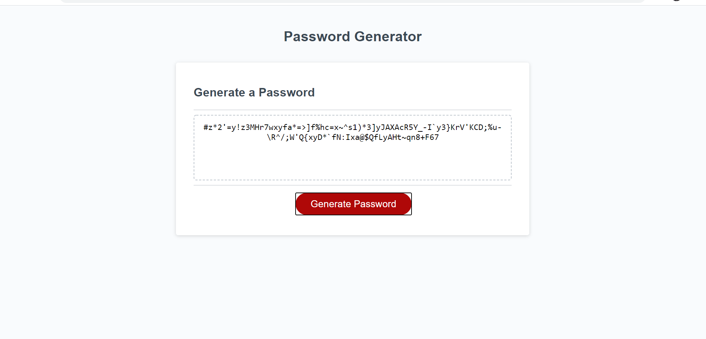

# Password Generator

## Description

For this project I have created a Password Generator that can be customized to created a secure password to the users preferred level of security. They have the option of selecting how long the password is as long as the number of characters is between 8 and 128 characters long. There is check to make sure the user chooses a number within this range by returning a string asked them to choose another number. Next they have the ability to decide whether they wish to use upper case letters, lower case letters, numbers, and special symbols such as ($) or (%). Once they have confirm all desired characters they generated password is displayed to the browser.

Below is a screenshot of the application as well as a link to the deployed webpage.

https://zreggert.github.io/zack_passgen_repo/

Copyright (c) 2021 Zachary Eggert

Permission is hereby granted, free of charge, to any person obtaining a copy
of this software and associated documentation files (the "Software"), to deal
in the Software without restriction, including without limitation the rights
to use, copy, modify, merge, publish, distribute, sublicense, and/or sell
copies of the Software, and to permit persons to whom the Software is
furnished to do so, subject to the following conditions:

The above copyright notice and this permission notice shall be included in all
copies or substantial portions of the Software.

THE SOFTWARE IS PROVIDED "AS IS", WITHOUT WARRANTY OF ANY KIND, EXPRESS OR
IMPLIED, INCLUDING BUT NOT LIMITED TO THE WARRANTIES OF MERCHANTABILITY,
FITNESS FOR A PARTICULAR PURPOSE AND NONINFRINGEMENT. IN NO EVENT SHALL THE
AUTHORS OR COPYRIGHT HOLDERS BE LIABLE FOR ANY CLAIM, DAMAGES OR OTHER
LIABILITY, WHETHER IN AN ACTION OF CONTRACT, TORT OR OTHERWISE, ARISING FROM,
OUT OF OR IN CONNECTION WITH THE SOFTWARE OR THE USE OR OTHER DEALINGS IN THE
SOFTWARE.