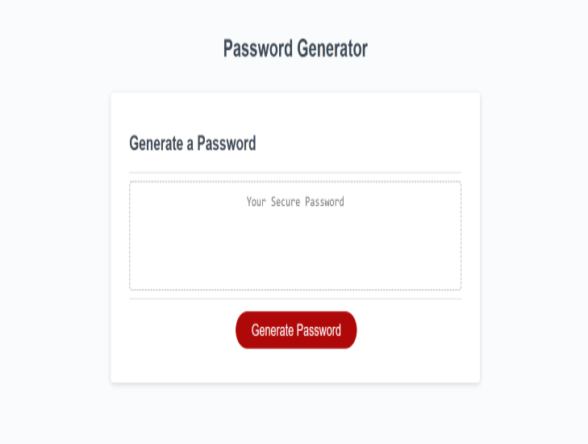

# Password Generator

## Description

For this project I have created a Password Generator that can be customized to created a secure password to the users preferred level of security. They have the option of selecting how long the password is as long as the number of characters is between 8 and 128 characters long. There is check to make sure the user chooses a number within this range by returning a string asked them to choose another number. Next they have the ability to decide whether they wish to use upper case letters, lower case letters, numbers, and special symbols such as ($) or (%). Once they have confirm all desired characters they generated password is displayed to the browser.

Below is a screenshot of the application.
